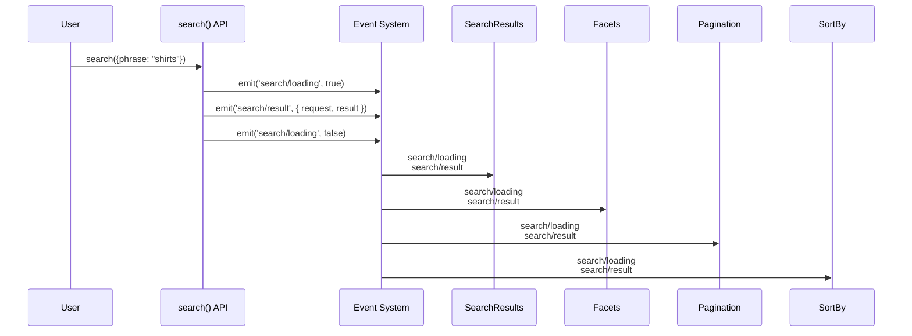

import { Badge } from '@astrojs/starlight/components';
import Callouts from '@components/Callouts.astro';
import Aside from '@components/Aside.astro';

The Product Discovery drop-in component v2.0.0 uses an event-driven system that enables containers to stay synchronized and provides real-time updates. This system supports multiple search instances, automatic container updates, and built-in analytics tracking.

## Event System Overview

### How It Works

The event system automatically keeps containers synchronized:



### Key Benefits

- **Automatic Synchronization**: Containers update automatically when search parameters change
- **Scope Isolation**: Multiple search instances with isolated state and analytics
- **Real-time Updates**: Instant container updates without manual intervention
- **Analytics Integration**: Built-in ACDL event tracking for search lifecycle
- **Performance Optimization**: Intelligent event handling and debouncing

## Event Types

### Search Lifecycle Events

#### `search/loading`

Emitted when a search operation starts or completes.

**Payload:**
```typescript
interface LoadingEvent {
  loading: boolean;           // true when starting, false when complete
  scope?: string;             // Scope identifier if provided
}
```

**Usage:**
```javascript
// Container automatically receives loading events
await provider.render(SearchResults)($container);

// When search() is called:
// 1. search/loading: true  (shows loading state)
// 2. search/loading: false (hides loading state)
```

#### `search/result`

Emitted when search results are received from the API.

**Payload:**
```typescript
interface ResultEvent {
  request: SearchParams;      // Original search request
  result: SearchResult;       // Search results and metadata
  scope?: string;             // Scope identifier if provided
}

interface SearchResult {
  products: Product[];        // Array of product objects
  totalCount: number;        // Total number of matching products
  pageInfo: PageInfo;        // Pagination information
  facets: Facet[];           // Available facets for filtering
}
```

**Usage:**
```javascript
// Container automatically updates with new results
await provider.render(SearchResults, {
  onSearchResult: (products) => {
    console.log('Received', products.length, 'results');
  }
})($container);
```

#### `search/error`

Emitted when a search operation encounters an error.

**Payload:**
```typescript
interface ErrorEvent {
  error: Error;               // Error object with message and details
  request: SearchParams;      // Original search request that failed
  scope?: string;             // Scope identifier if provided
}
```

**Usage:**
```javascript
// Container automatically handles errors
await provider.render(SearchResults)($container);

// Error events are automatically displayed in the container
```

### Container-Specific Events

#### `facets/change`

Emitted when facet selections change.

**Payload:**
```typescript
interface FacetChangeEvent {
  filters: Filter[];          // Updated filter array
  scope?: string;             // Scope identifier if provided
}
```

#### `pagination/change`

Emitted when pagination changes.

**Payload:**
```typescript
interface PaginationChangeEvent {
  page: number;               // New page number
  scope?: string;             // Scope identifier if provided
}
```

#### `sort/change`

Emitted when sort order changes.

**Payload:**
```typescript
interface SortChangeEvent {
  sort: Sort[];               // Updated sort array
  scope?: string;             // Scope identifier if provided
}
```

## Advanced Features

### Scope Support

Events can be scoped to specific search instances:

```javascript
// Global search - all containers receive events
await api.search({
  phrase: 'shirts',
  pageSize: 12
});

// All containers receive: search/loading, search/result
```

### Scoped Events

Events with a scope are only sent to containers with matching scope:

```javascript
// Scoped search - only popover containers receive events
await api.search({
  phrase: 'shirt',
  pageSize: 6
}, { scope: 'popover' });

// Only containers with scope: 'popover' receive events
```

### Multiple Scopes

You can have multiple isolated search instances:

```javascript
// Main PLP search
await api.search({
  phrase: 'shirts',
  pageSize: 12
}, { scope: 'main' });

// Quick search popover
await api.search({
  phrase: 'shirt',
  pageSize: 6
}, { scope: 'popover' });

// Category browse
await api.search({
  phrase: '',
  filter: [{ attribute: 'categoryPath', eq: 'apparel' }]
}, { scope: 'category' });
```

## Container Features

### Automatic Event Handling

Containers automatically listen to relevant events based on their scope:

```javascript
// Global scope container
await provider.render(SearchResults)($container);
// Listens to all search events

// Scoped container
await provider.render(SearchResults, { scope: 'popover' })($container);
// Only listens to events with scope: 'popover'
```

### Event Callbacks

Containers support callbacks for custom event handling:

```javascript
await provider.render(SearchResults, {
  onSearchResult: (products) => {
    console.log('Search results received:', products);
  },
  onError: (error) => {
    console.error('Search error:', error);
  }
})($container);
```

## Custom Event Handling

### Manual Event Listening

For advanced use cases, you can manually listen to events:

```javascript
import { events } from '@dropins/tools/event-bus.js';

// Listen to all search events
events.on('search/result', (event) => {
  console.log('Search result:', event);
});

// Listen to scoped events
events.on('search/result', (event) => {
  if (event.scope === 'popover') {
    console.log('Popover search result:', event);
  }
});
```

### Event Filtering

Filter events by type and scope:

```javascript
// Listen to specific event types
events.on('search/loading', (event) => {
  if (event.loading) {
    showGlobalLoading();
  } else {
    hideGlobalLoading();
  }
});

// Listen to specific scopes
events.on('search/result', (event) => {
  switch (event.scope) {
    case 'main':
      updateMainResults(event.result);
      break;
    case 'popover':
      updatePopoverResults(event.result);
      break;
    case 'category':
      updateCategoryResults(event.result);
      break;
  }
});
```

## Performance Features

### Automatic Debouncing

The event system automatically debounces rapid event sequences:

```javascript
// Multiple rapid searches are debounced
await api.search({ phrase: 'shirt' });
await api.search({ phrase: 'shirts' }); // Previous search is cancelled
await api.search({ phrase: 'shirts' }); // Previous search is cancelled
// Only the last search executes
```

### Event Cleanup

Containers automatically clean up event listeners when destroyed:

```javascript
// Event listeners are automatically cleaned up
const container = await provider.render(SearchResults)($container);

// Later, when container is removed
$container.remove(); // Event listeners are automatically cleaned up
```

## Analytics Integration

### ACDL Event Tracking

The system automatically tracks search lifecycle events:

```javascript
// ACDL events are automatically emitted for:
// - search/request: When search starts
// - search/response: When results are received
// - search/view: When results are displayed
// - search/click: When products are clicked

// No additional configuration needed
await api.search({ phrase: 'shirts' });
// Analytics events are automatically tracked
```

### Custom Analytics

Add custom analytics tracking:

```javascript
events.on('search/result', (event) => {
  // Track custom metrics
  trackSearchMetrics({
    query: event.request.phrase,
    resultCount: event.result.totalCount,
    filters: event.request.filter,
    scope: event.scope
  });
});
```

## Testing Features

### Mocking Events

For testing scenarios, you can mock the event system:

```javascript
import { events } from '@dropins/tools/event-bus.js';

// Mock search result event
events.emit('search/result', {
  request: { phrase: 'test' },
  result: {
    products: [mockProduct],
    totalCount: 1,
    pageInfo: mockPageInfo,
    facets: mockFacets
  }
});
```

### Event Assertions

Test that containers receive expected events:

```javascript
// Test that container updates on search result
const mockEmit = jest.spyOn(events, 'emit');

await api.search({ phrase: 'test' });

expect(mockEmit).toHaveBeenCalledWith('search/loading', true);
expect(mockEmit).toHaveBeenCalledWith('search/result', expect.any(Object));
expect(mockEmit).toHaveBeenCalledWith('search/loading', false);
```

## Best Practices

1. **Scope Management**: Use unique scope identifiers for multiple search instances
2. **Automatic Updates**: Let containers handle events automatically
3. **Performance**: Use scoping to limit event propagation to relevant containers
4. **Testing**: Mock the event system for isolated container testing
5. **Analytics**: Leverage built-in ACDL event tracking

## Troubleshooting

### Common Issues

1. **Events Not Received**: Check container scope matches search scope
2. **Multiple Updates**: Ensure containers aren't listening to multiple scopes
3. **Memory Leaks**: Containers automatically clean up event listeners
4. **Performance Issues**: Use scoping to limit unnecessary event propagation

### Debug Tools

```javascript
// Enable event logging
import { events } from '@dropins/tools/event-bus.js';

events.on('*', (eventName, payload) => {
  console.log(`Event: ${eventName}`, payload);
});
```

## Examples

See the [Installation Guide](./installation.mdx) and [Containers Guide](./containers.mdx) for complete examples of:

- Basic event flow in PLP setup
- Scoped event handling for quick search
- Custom event handling with callbacks
- Advanced event filtering and scoping 